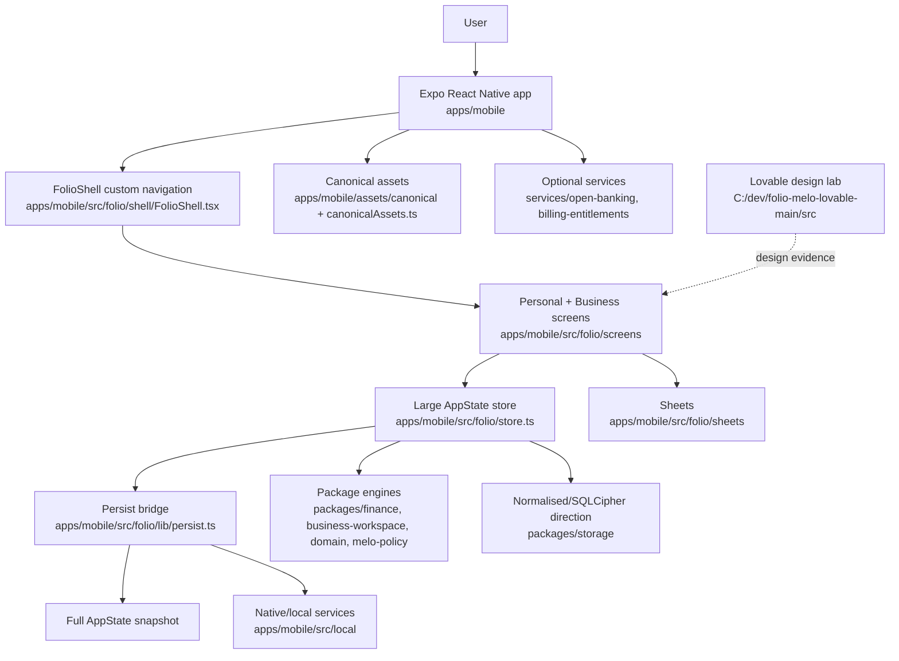

# Melo architecture authority

Status: Phase B authority map. Use strangler migrations; do not perform a giant rewrite.

Phase B executable boundary: `packages/domain/src/trustedCore.ts` now declares `trustedCoreResponsibilityOwners`, `TrustedSafeRangeResult`, `DecisionLedgerRecord`, Truth classes, migration scaffolding, and workspace-boundary checks. The document below is the human-readable form of those contracts; the code constants are the machine-checkable guard for Phase C.

## Current architecture diagram

## Authority table

| Overlap/responsibility | Canonical owner | Adapter retained | Migrate/deprecate/remove | Order | Rollback |
| --- | --- | --- | --- | --- | --- |
| Financial ledger | Domain/storage package should become canonical. | `apps/mobile/src/folio/store.ts` remains adapter during Trusted Core. | Migrate high-risk write paths behind repository contracts. | After Truth Model tests. | Keep AppState snapshot read path. |
| Account/current position | Account repository + provenance model. | Current `setCurrentBalance` path in `store.ts`. | Add source/freshness; do not duplicate balance truth. | Phase C. | Revert adapter to old scalar if tests fail. |
| Forecast/Safe Zone | New Trusted Safe Range package contract. | Existing route/forecast helpers feeding `TodayScreen`/`MoneyPath`. | Deprecate single Safe Zone semantics. | Phase C. | Feature flag old Today path. |
| Calendar derivation | Deterministic finance/calendar package. | Current `CalendarScreen.tsx` local derivation. | Move derivation out of screens. | Phase C/E. | Screen-local derivation remains read-only fallback. |
| Review queue | Store/repository candidate model. | Existing Review store slices. | Add truth classes before redesign. | Phase B/C. | Existing Review queue remains. |
| Intake/parsing | Native/local parsers plus review candidate contract. | `IntakeScreen.tsx`, PDF/photo/CSV paths. | Keep Android proof; non-Android claim blocked. | Phase C/F. | Manual/paste/CSV paths. |
| Melo tools | `toolContract.ts` + confirmation UI + store bridge. | `MeloChatSheet.tsx`, `localMeloTurn.ts`. | Add Decision Ledger records; do not let AI write directly. | Phase D. | Disable tool suggestions. |
| AI gateway | Bounded local/client adapter. | Retired compatibility parser noted in `meloAiClient.ts`. | Provider AI remains off production path until policy/tests. | Phase F/G. | Deterministic local Melo only. |
| Persistence | SQLCipher-backed repositories target. | Full AppState snapshot for compatibility. | Strangle per domain; avoid big-bang migration. | B-F. | Restore snapshot. |
| Evidence storage | Source/evidence repository with retention rules. | Existing file/import metadata. | Add fact refs and retention; not all raw files in ledger. | Phase C/D. | Export raw current state. |
| Cloud backup/sync | Deferred service with explicit trust model. | Current cloud backup sheet/copy if gated. | Keep non-operational flows visibly pending. | Phase F+ | Local-only mode. |
| Authentication | Release account/subscription auth path. | Existing sign-in/account sheets. | Do not block local Trusted Core on cloud auth. | Phase F. | Offline local mode. |
| Open Banking | Optional provider service, not Trusted Core default. | `openBankingNative.ts`, `BankConnectionSheet.tsx`. | Keep fail-closed until provider credentials/callback proof. | Phase F/G. | Manual import. |
| Billing | Billing packages/services. | Existing paywall/entitlement code. | Align copy/pricing only after product scope. | Phase F. | Disable paid gates for beta if needed. |
| Notifications/widget | Native surfaces. | `SafeZoneWidget.tsx`, notification stubs. | Defer until Safe Range reliable. | Phase F/G. | In-app only. |
| Analytics/audit logging | Privacy-preserving event/audit layer. | Test/evidence docs and local audit fragments. | Add only consented, minimal analytics. | Phase F/G. | No analytics. |
| Security | Local-first encrypted storage. | App lock, SQLCipher direction, privacy docs. | Prove restore/delete/export paths. | Phase F. | Local export/manual restore. |
| Accessibility/design tokens | RN kit + package tokens + Lovable CSS evidence. | `kit.tsx`, `kitTheme.tsx`, `packages/ui`, Lovable `styles.css`. | One token authority; no paper on accent. | Phase A/B. | Source guard tests. |
| Navigation | Trusted Core IA route map. | `FolioShell.tsx` custom nav and Expo route. | Do not switch routers until journey specs pass. | Phase E. | Current shell. |
| Personal vs Business | Workspace-specific domain boundary. | Current workspace slices in `store.ts`. | Business separate product; shared infra only. | B onward. | Hide Business from Personal beta. |
| Old/new docs | This convergence packet. | Historical docs remain evidence. | Supersede by reference, not deletion. | Phase B. | Re-open decision log. |

## Phase B canonical owners

| Responsibility | Canonical owner | Runtime adapter during compatibility window | Compatibility authority | Migration phase |
| --- | --- | --- | --- | --- |
| Account model | `@folio/domain` | `apps/mobile/src/folio/store.ts` | Dual-read, AppState wins until migrated | Phase C |
| Ledger | `@folio/storage` | `apps/mobile/src/folio/store.ts` | Dual-read, AppState wins until migrated | Phase D |
| Recurring obligations | `@folio/domain` | `apps/mobile/src/folio/lib` | Dual-read, AppState wins until migrated | Phase C |
| Forecast engine | `@folio/finance-engine` | `apps/mobile/src/local` | Dual-read, AppState wins until migrated | Phase C |
| Truth classification | `@folio/domain` | `apps/mobile/src/folio/lib` | AppState snapshot remains compatibility source | Phase C |
| Safe Range result | `@folio/domain` | `apps/mobile/src/local` | Dual-read, AppState wins until migrated | Phase C |
| Decision Ledger | `@folio/domain` | `apps/mobile/src/folio/lib` | AppState snapshot remains compatibility source | Phase D |
| Review queue | `@folio/domain` | `apps/mobile/src/folio/store.ts` | Dual-read, AppState wins until migrated | Phase C |
| Persistence | `@folio/storage` | `apps/mobile/src/folio/lib` | AppState snapshot retained | Phase F |
| Corrections | `@folio/domain` | `apps/mobile/src/folio/store.ts` | Dual-read, AppState wins until migrated | Phase D |
| Melo tools | `@folio/domain` | `apps/mobile/src/folio/store.ts` | AppState snapshot compatibility | Phase D |
| Workspace boundaries | `@folio/domain` | `apps/mobile/src/folio/store.ts` | Dual-read, AppState wins until migrated | Phase B |
| Normalised SQL storage | `@folio/storage` | `apps/mobile/src/local` | Normalised SQL | Phase D |
| Full AppState generations | `apps/mobile/src/folio/store.ts` | `apps/mobile/src/folio/lib` | AppState snapshot | Phase F |
| Navigation transition | `apps/mobile/src/folio/shell/FolioShell.tsx` | None | AppState snapshot for route-relevant local state | Phase E |
| Evidence storage | `@folio/storage` | `apps/mobile/src/folio/store.ts` | Dual-read, AppState wins until migrated | Phase D |

## Normalised SQL vs full AppState authority

Decision: AppState remains the compatibility authority until the corresponding normalised store has a tested projection, migration, restore, rollback, and export path. Normalised SQL becomes canonical by domain slice, not all at once.

Rules:

- New Trusted Core contracts live in `@folio/domain`.
- Normalised SQL writes must be workspace-scoped and source/provenance-aware.
- Full AppState generations remain durable rollback evidence until Phase F proves restore/delete/export on migrated slices.
- During dual-read windows, disagreement is not auto-resolved: the app uses the existing AppState path and records the mismatch for migration review.
- Encrypted backups must restore the legacy snapshot first, then replay or rebuild migrated projections.
- Evidence files are retained by source reference; Decision Ledger records do not duplicate raw files.

## Migration principles

- New truth and ledger models are introduced at boundaries before screen redesign.
- Every migrated write path gets an acceptance test and rollback path.
- Working systems survive until replacement evidence passes.
- Package existence is not proof of active use.
- Visual parity with Lovable requires device evidence, not source similarity.
