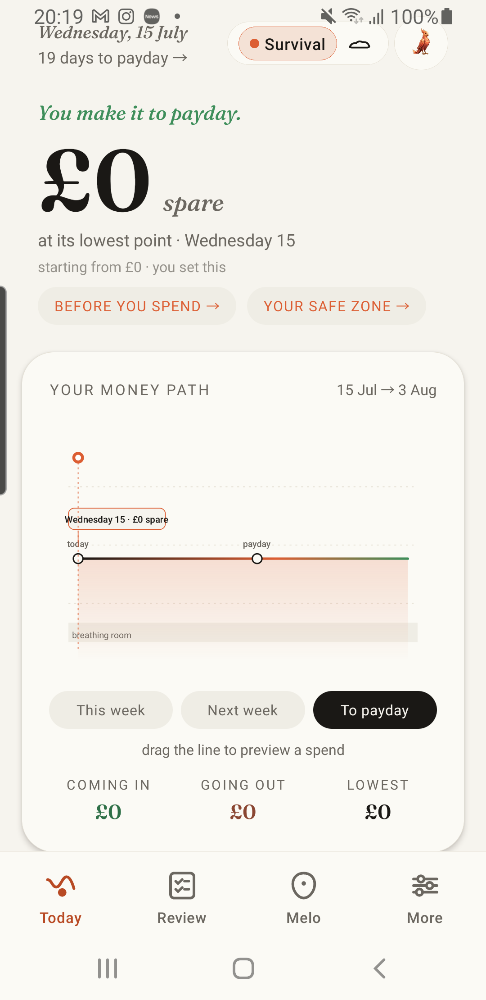
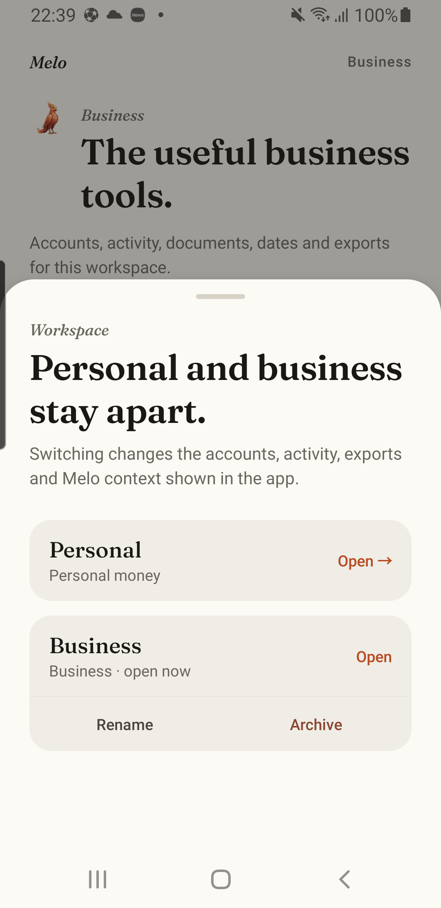
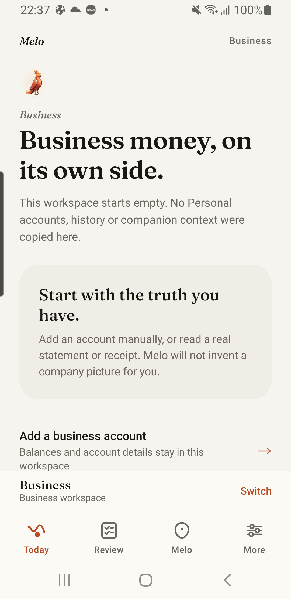
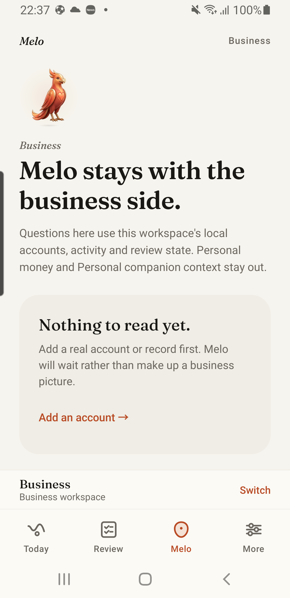
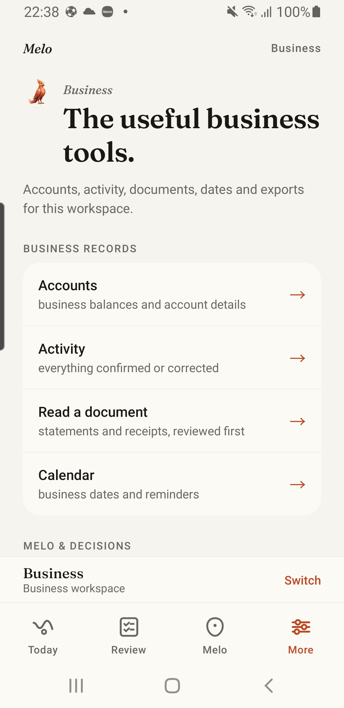
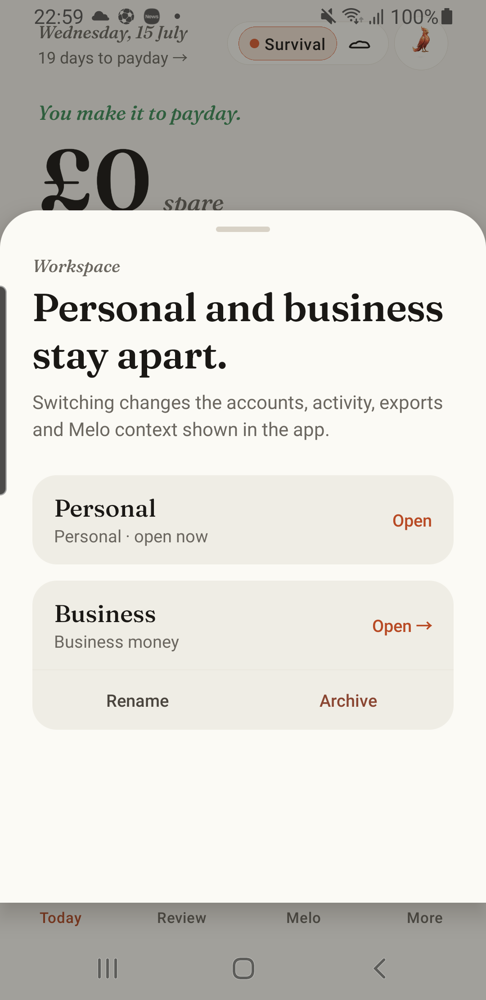

# Business workspace production foundation and row isolation — 2026-07-15

## Verdict

The production Business isolation and lifecycle foundation is implemented across the authoritative
React Native app. Schema v9 establishes explicit Personal ownership. Schema v10 adds non-null row
ownership, a workspace-scoped repository and fail-closed query/write boundaries. Schema v11 adds an
encrypted manifest, authenticated per-workspace state files, opaque per-workspace SQLCipher
databases with distinct derived keys, and atomic create/switch/rename/archive/restore operations.
Backup/recovery, Open Banking, notifications, companion cache/widget, export/restore/deletion and
native persistence require or cryptographically bind workspace ownership.

A persistent labelled workspace control and empty Business Today, More and Melo surfaces are also
checked in, without sample financial data. This remains foundation evidence rather than a completed
Business alpha claim: manual Business intake/review, evidence, dated cash flow and accountant-ready
export are not yet complete, and the latest UI/storage slice still requires current device evidence.

## Reconciliation decision

The repository already contained mature canonical `Workspace`, workspace-scoped repository and
`@folio/business-workspace` evaluator contracts. Those were reused. No second domain model,
historical Phase 13 screen set or sample company was created.

The missing seam was the current production mobile store, whose top-level arrays were implicitly
Personal. Schema v9 makes the enclosing ownership durable; schema v10 stamps and checks each row;
schema v11 gives the active workspace its own encrypted state and native database. The current
implementation permits an empty Business workspace and real Business-owned rows, but it never
creates sample accounts, transactions, invoices, receipts or balances.

## What is implemented

- `Workspace` comes from `@folio/domain` and the production adapter maps it into the existing
  `@folio/business-workspace` switcher contract.
- Schema v9 introduces the immutable `workspace_personal_local` owner. Schema v11 persists an
  optional Business workspace alongside it and requires `activeWorkspaceId` and `dataWorkspaceId`
  to identify the loaded partition.
- The encrypted manifest is the workspace-registry commit record. Each workspace has an opaque
  authenticated encrypted state filename and a derived purpose-separated subkey.
- Each workspace also has an opaque SQLCipher database filename and its own 256-bit HKDF-derived
  database key. The raw workspace ID and device master key do not become the database key or name.
- Only Personal can open and migrate the historic `folio_local_ledger.sqlite`; Business never opens
  it. Migration verifies the scoped Personal database before clearing the legacy tables.
- The v8-to-v9 migration preserves existing financial rows byte-for-byte while assigning the whole
  current data partition to Personal.
- The v9-to-v10 migration preserves row values while assigning `workspace_personal_local` to every
  persisted pot, subscription, cycle, pot-ledger entry, transaction, edit, calendar event, debt,
  plan, tiny win, timeline event, review/spillover item, income source, drift entry, statement import
  and account. Transient statement-reader candidates are stamped while staged but remain excluded
  from persistence.
- Load-time normalisation rejects malformed workspace roots and mixed-owner partitions. Business is
  never accepted as a cosmetic filter over Personal arrays.
- Local clear and account deletion enumerate every retained workspace, clear its notifications,
  runtime state, encrypted file and SQLCipher data, then write genuinely empty partitions while
  preserving stable workspace IDs so remote scopes are not orphaned.
- A shared `requireWorkspaceData` guard rejects reads unless the requested workspace exists, is
  active, owns the current partition and is not archived.
- The guard is wired into Melo's aggregate snapshot, deterministic calculations, local account
  resolution and the complete data export. Those readers throw rather than expose Personal data
  after a mismatched workspace switch.
- Every live `getState`/`useAppStore` read and native persist serialization checks the root and all
  row owners before returning data. `getWorkspaceRowRepository(workspaceId)` exposes addressable
  collections only after the complete partition passes; it returns the original collection rather
  than filtering a global array.
- Every store patch stamps missing Personal owners, rejects a conflicting Business-owned row and
  refuses further data writes after a crafted workspace switch until canonical recovery/reset.
- Cloud backup envelope v2 authenticates an opaque SHA-256 workspace reference as AES-GCM
  associated data. Mobile recovery-code keys and Worker object paths are workspace-scoped; Personal
  v1 recovery remains readable without allowing it into Business. Account deletion enumerates the
  complete hashed-user prefix and removes every workspace backup.
- Open Banking sends the same opaque workspace reference. Worker indexes, connection records,
  OAuth callback state, sync and disconnect ownership are workspace-scoped. New encrypted provider
  records authenticate the hashed user, workspace and connection as AES-GCM associated data.
  Headerless historic clients and account-level records map only to Personal; account deletion
  purges every workspace connection.
- Scheduled notification metadata and runtime files carry workspace ownership. Calendar and
  insight batches reject mixed owners before changing native schedules. Notification preferences
  remain intentionally device-global policy because they contain no financial/event content.
- Companion statement-read cache APIs require a workspace and reject a false Business switch. The
  home-screen widget is explicitly one active-workspace projection and refuses mismatched writes.
- Export, restore, local deletion and encrypted main/native ledger persistence require an explicit
  workspace. Business uses its own file, SQLCipher database, database key and row owner; archived
  workspaces cannot load or save but remain clearable for account-wide deletion.
- Business creation stages an empty encrypted state file and empty SQLCipher database before
  writing Personal registry state and committing the manifest last. Failed provisioning rolls back
  staged artifacts. Switches reconcile stale inactive metadata after interrupted writes.
- Rename, archive and restore revise workspace metadata without merging records. Archiving an active
  Business safely returns to Personal and preserves the encrypted Business partition for restore.
- The native shell keeps Today, Review, Melo and More in the primary bar. A separate persistent
  labelled control opens accessible create/switch/rename/archive/restore actions. Business Today,
  More and Melo render scoped empty states rather than invented company data.
- Search/storage package queries were already workspace-keyed. Native document picker and text
  extraction inputs are transient on-device data and do not retain a second unowned document copy.

## Attack tests

Checked-in tests cover:

- crafted Business workspace insertion and activation;
- mismatched active and data-partition IDs;
- corrupt Personal label/subkey metadata;
- reset after an injected Business selection;
- v8 migration with existing real transaction rows;
- v9-to-v10 migration across every production row collection without dropping real row values;
- persisted-root round-trip;
- missing row ownership, conflicting Business row ownership and mixed-owner collection attacks;
- scoped-repository reads for the valid workspace and rejection for the wrong workspace;
- ordinary write/persist stamping and refusal to rewrite a conflicting owner;
- refusal of all data writes after a crafted active-workspace switch;
- Melo aggregate, calculation and account-name access after a false Business switch; and
- export after a false Business switch;
- wrong-workspace cloud decrypt/restore, tampered backup binding, two-workspace object isolation and
  whole-account purge;
- mixed-workspace notification batches, wrong-owner cancellation and legacy Personal cleanup;
- wrong-workspace companion cache, widget, local deletion, file persistence and SQLite access; and
- two Open Banking workspaces under one user, cross-workspace connection-ID sync/delete attacks,
  callback binding, invalid references, Personal-only legacy migration and whole-account purge.
- distinct opaque state/database names and derived keys for Personal and Business;
- Business SQL writes carrying only the requested Business owner and never opening the legacy
  Personal database;
- Personal-only legacy SQLCipher migration, scoped verification and legacy-table cleanup;
- staged Business creation rollback when native database provisioning fails;
- pre-manifest creation crashes where the old manifest remains authoritative;
- switch reconciliation when an inactive partition carries stale registry metadata;
- rename, switch, archive and restore while retaining isolated Business data; and
- account-wide local deletion followed by empty encrypted generations for every retained workspace.

No test or runtime path creates a sample Business, client, invoice, balance or transaction.

## Validation

The latest targeted workspace partition, lifecycle, deletion, store, native SQLCipher, key
derivation, vault, canonical adapter and local-ledger suite passed 9 files and 324 tests. Mobile
typecheck and formatting passed. The earlier backup/Open Banking/notification/cache/restore suites
remain covered by the complete repository gate.

The complete repository gate passed:

- 194 test files;
- 2,381 tests;
- all package and service typechecks;
- formatting, dependency and V1 boundaries;
- sample-data policy, constitution and canonical product gates; and
- source-package and fixture validation.

The public-release gate remains deliberately blocked by the separately registered iOS, independent
accessibility/security, store, billing, legal and operations requirements.

## Earlier schema-v10 Android checkpoint

The production Android release was rebuilt for both supported evidence ABIs and contains:

- `lib/arm64-v8a/libreactnative.so`; and
- `lib/x86_64/libreactnative.so`.

An in-place install of the debug-signed copy on the physical Galaxy S9 succeeded without clearing
application data. Android retained the original `firstInstallTime` of `2026-06-26 15:22:33` and
recorded `lastUpdateTime=2026-07-15 20:18:55`. The installed app focused
`com.folio.v2.greenfield/.MainActivity`, and the captured post-launch log contained zero
`AndroidRuntime` or `ReactNativeJS` error-level entries.

The post-migration screen remained the owner's existing empty Personal state: £0 values, the Melo
tab still present in the primary navigation, and no injected Business workspace, sample company or
sample money. This is physical migration, launch and data-preservation evidence. It is not evidence
of Business UI, which intentionally does not exist yet.

The PNG is 198,791 bytes with SHA-256
`CE4B771D69C4A91B26FDD1942CEDC20F973F17A3207EA4F7F30F80238092BED8`.

The older device's UI Automator could not reach an idle state, so text assertions were not inferred
from a failed semantic dump. The screen was inspected directly from the captured PNG; package,
focus and error checks came from Android system output.

## Current schema-v11 Android lifecycle and UI proof

The final production-signed APK was rebuilt with explicit `arm64-v8a,x86_64` React Native
architectures. The first current build inherited the repository's arm64-only default and therefore
could not load `libreactnative.so` on the x86_64 emulator. That artifact was rejected. The rebuilt
artifact contains both ABIs; the emulator selected `primaryCpuAbi=x86_64` and logged a successful
load of `lib/x86_64/libreactnative.so`.

The production-signed APK updated the emulator in place. A debug-signed copy of the identical APK
updated the Galaxy S9 in place because that device's existing installation uses the debug
certificate. The S9 retained `firstInstallTime=2026-06-26 15:22:33`; the final update times were
`2026-07-15 22:36:11` on the emulator and `2026-07-15 22:36:16` on the S9. Both focused
`com.folio.v2.greenfield/.MainActivity`. Post-fix logs contained zero fatal exceptions, zero
`Screen crashed` entries and zero maximum-update-depth errors.

The physical pass exercised:

- the persistent Personal workspace rail while keeping Today, Review, Melo and More unchanged;
- opening the native workspace sheet and creating one genuinely empty workspace named `Business`;
- relaunch after creation and in-place APK update, with the active Business partition retained;
- empty Business Today, Melo and More surfaces without Personal rows or invented company data;
- switching back to the pre-existing Personal partition with its prior state unchanged;
- rename persistence, then returning the label to the neutral `Business` name;
- archive confirmation, archived text state and restore; and
- a final Personal-active state with the empty restored Business workspace retained.

The first physical Business Today render exposed a real release-only React failure: its Zustand
selector returned a freshly filtered array on every external-store snapshot and hit React's maximum
update depth. The selector was changed to a primitive account count, the mobile typecheck and
324-test targeted suite passed, both ABIs were rebuilt, and the same physical path then rendered
without a screen-boundary or process error.

This proves the empty workspace lifecycle and current native UI on Android. It does not prove
manual Business records, iOS, recovery interruption, deep-link/notification switching or a public
Business alpha.

## Reproducible Android artifacts

| Artifact                                                                                                        |       Bytes | SHA-256                                                            | Signing certificate SHA-256                                        | Signature schemes |
| --------------------------------------------------------------------------------------------------------------- | ----------: | ------------------------------------------------------------------ | ------------------------------------------------------------------ | ----------------- |
| `artifacts/android-physical-private/melo-business-workspace-row-isolation-2026-07-15-production-signed.apk`     | 108,730,459 | `57665A4B0DC654F21F61741E54EE4773D16302F5D78B9A663322FAE21E31C96E` | `547396E1FD99681C2A6D768B8B7D1B4484B5F42A17597CAD6C495221267A5488` | v2                |
| `artifacts/android-physical-private/melo-business-workspace-row-isolation-2026-07-15-physical-debug-signed.apk` | 108,827,062 | `DCE41AE660F8F998D69B6C024E0A844C8F825F899CEB29211E679F3451853DF0` | `FAC61745DC0903786FB9EDE62A962B399F7348F0BB6F899B8332667591033B9C` | v2, v3            |
| `artifacts/android-physical-private/melo-business-workspace-v11-2026-07-15-production-signed.apk`               | 108,785,471 | `054CFA92277C98D7AA0975D241DFA1ABE0835529FD232293D7DBDF249BB33DBD` | `547396E1FD99681C2A6D768B8B7D1B4484B5F42A17597CAD6C495221267A5488` | v2                |
| `artifacts/android-physical-private/melo-business-workspace-v11-2026-07-15-physical-debug-signed.apk`           | 108,880,310 | `DA516EC13A05C5F855AD778EBA03ED1724A97C5CF40547507C4C6775521AA6DC` | `FAC61745DC0903786FB9EDE62A962B399F7348F0BB6F899B8332667591033B9C` | v2, v3            |

The physical proof used the debug-signed copy because that certificate matches the existing
owner-device installation. The production-signed artifact was verified independently and was not
installed over a differently signed package.

## What remains before Business alpha is complete

- complete physical attack coverage for rapid switching, recovery, deep links, notification taps
  and interrupted writes, plus iOS and full accessibility evidence;
- complete real manual Business accounts/activity, document-to-Review confirmation, source
  evidence, dated cash position/runway and recurring commitments;
- complete Business-scoped accountant-ready CSV/JSON export and visually/semantically verify PDF
  before adding it;
- complete Business-specific companion calculations and memory semantics beyond the already scoped
  empty/local shell; and
- close entitlement, tax/legal language, support and store-declaration gates before any public
  Business release claim.

The isolation, lifecycle and empty native surface foundation is checked in. It must not be described
as a finished Business alpha or public-release-ready product until the remaining workflow and
evidence gates close.
